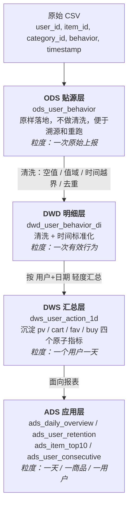

# 电商用户行为离线数仓

> 基于淘宝用户行为公开数据集，搭建 **ODS → DWD → DWS → ADS** 四层离线数仓，
> 产出用户留存、购买转化、商品热度等核心指标，并沉淀统一的指标口径。
>
> **技术栈**：`Python` · `SQL (SQLite)` · `窗口函数` · `分层建模`
> **数据集时间范围**：2017-11-25 ~ 2017-12-03（9 天）

---

## 一、项目背景

电商平台每天产生海量用户行为日志（浏览、加购、收藏、购买）。原始日志存在
**字段缺失、行为类型异常、时间戳越界、重复上报**等问题；同时各业务方各自写 SQL 取数，
导致同一指标在不同报表中口径不一致。

本项目通过**分层建模**解决三个问题：

1. **数据质量** —— 在 DWD 层统一完成清洗，保证下游使用的数据可信
2. **口径统一** —— 在 DWS 层沉淀公共指标，避免重复计算和口径分歧
3. **查询效率** —— 在 ADS 层产出面向报表的成品指标，避免每次查询都扫描全量明细

---

## 二、数据源

| 项 | 说明 |
|---|---|
| 来源 | 阿里天池 · 淘宝用户行为数据集（UserBehavior） |
| 格式 | 无表头 CSV，逗号分隔，5 列，纯 ASCII |
| 规模 | **100,150,807 行**，CSV 约 **3.42 GB** |
| 字段 | `user_id`, `item_id`, `category_id`, `behavior`, `timestamp` |
| 行为类型 | `pv` 浏览 / `cart` 加购 / `fav` 收藏 / `buy` 购买 |
| 时间范围 | 2017-11-25 ~ 2017-12-03（共 9 天） |

> **本项目内置样例数据生成器**，无需下载数据集即可运行体验（`python dw_pipeline.py`）。
> 要跑真实数据，用 `--csv UserBehavior.csv` 指定天池下载的文件即可。

> ⚠️ 数据集**无金额字段**，因此本项目用**购买次数（buy_cnt）作为 GMV 的代理指标**，
> 口径已在 [指标口径说明](docs/指标口径说明.md) 中明确声明。

---

## 三、数仓分层架构



### 分层数据量变化

<details>
<summary><b>展开查看数据量递减（真实数据集 1 亿行的实际结果）</b></summary>

| 层 | 表 | 行数 | 粒度 | 一行代表什么 |
|---|---|---|---|---|
| ODS | `ods_user_behavior` | **100,150,807** | 一次原始上报 | 一条未清洗的日志 |
| DWD | `dwd_user_behavior_di` | **100,095,182** | 一次有效行为 | 一条洗干净的行为 |
| DWS | `dws_user_action_1d` | **6,968,544** | 用户 × 天 | 某用户某天的行为汇总 |
| ADS | `ads_daily_overview` | **9** | 天 | 一整天的核心指标 |

**数据量从 1 亿行降到 9 行，但能回答的问题反而更精确了** —— 因为粒度逐层变粗，
换来的是查询更快、口径更统一。这就是分层的价值。

> 上表是真实天池数据集（3.42 GB / 1 亿行）的实测结果。
> 内置样例数据（约 1 万行）的结构完全相同，只是量级更小，便于快速体验。

</details>

### ADS 层四张表

| 表 | 说明 | 行数 | 行数由什么决定 |
|---|---|---|---|
| `ads_daily_overview` | 每日 PV / UV / 购买用户数 / 购买转化率 | 9 | 天数 |
| `ads_user_retention` | 次日留存率 | 9 | 天数 |
| `ads_item_top10` | 每日商品浏览 Top10 | 90 | 天数 × 10 |
| `ads_user_consecutive` | 连续活跃 ≥3 天的用户 | 863,990 | **达标用户数**（已筛选） |

> **注意 `ads_user_consecutive`**：真实数据里有约 100 万活跃用户，但只有 **863,990** 行。
> 因为 SQL 里有 `HAVING MAX(days) >= 3`，**只保留连续活跃 ≥3 天的用户**。
> 所以它的行数是"达标用户数"，不是总用户数 —— **这是面试容易被追问的点。**

---

## 三·四、建仓前的数据探查（pandas）

正式建仓前，先用 `explore.py` 摸清数据质量，**据此确定该定哪些清洗规则**：

```bash
python explore.py --csv UserBehavior.csv --nrows 3000000
```

**真实数据（300 万行抽样）的探查结果**：

| 探查项 | 结果 | 对应清洗规则 |
|---|---|---|
| 主键空值 | 0 行 | 空值过滤（保留规则，防患） |
| **behavior 非法值** | 0 行 | 值域校验 |
| **时间戳越界** | **1,467 行** | 按日期范围过滤 |
| **重复上报** | **2 行**（1 组） | 四字段判重去重 |
| 商品热度分布 | Top 1% 商品占 17.94% | 提示存在倾斜风险 |
| **UTC 日期 ≠ 本地日期** | **11.33%** | 说明时区处理是必要的 |

### 越界数据的构成（值得注意）

那 1,467 行越界数据**不是杂乱的脏数据**，而是高度集中在边界附近：

| 日期 | 行数 | 性质 |
|---|---|---|
| **2017-11-24** | **1,184** | 数据集起始日**前一天** |
| 2017-11-19 ~ 11-23 | 191 | 起始日之前 |
| 2017-12-04 / 12-06 | 7 | 结束日之后 |
| 2015 / 1970 / 2018 | 19 | 明显异常值（如时间戳 0） |

**1,149 行落在本地时间 11-24 的整天范围内**（00:05 ~ 23:59），
而不是集中在某一时刻——所以它们是**真实属于 11-24 的记录**，
只是落在数据集声明的起始日期（11-25）之前。

**这意味着**：官方的日期范围 `2017-11-25 ~ 2017-12-03` 是一个**边界约定**，
数据在两侧都有少量溢出。按约定过滤是正确做法，但**要知道自己丢弃了什么**——
这 1,184 行占本次抽样的 0.04%，对整体指标影响很小，且口径是明确的。

> **为什么这一步用 pandas，而不是标准库**：
> 探查是一次性的、需要灵活试，`describe` / `value_counts` / `duplicated`
> 比自己写循环快得多；而**正式建仓链路要保持零依赖、可复现**，所以仍用标准库 + SQLite。
> 两者分工明确，不是重复劳动。

---

## 三·五、真实数据的一个特征（面试可讲）

跑真实数据后，指标在后两天出现了明显跳变：

| 日期 | 活跃 UV | 次日留存 |
|---|---|---|
| 2017-11-25 ~ 11-30 | 约 70-73 万 | 约 78% |
| 2017-12-01 | 74 万 | 98.25% ← 跳变 |
| 2017-12-02 | **97 万** | 97.98% |
| 2017-12-03 | 96.7 万 | —（无次日数据） |

**这不是 bug，是数据集的采样特征**：该数据集取自天猫双 12 前后的日志，
12 月 1 日起大促流量开始涌入，新增大量高活跃用户，导致 UV 上升、留存同步走高。

**为什么值得讲**：面试官问"你的指标有没有异常"，能答出
**"有跳变，我排查后确认是数据源本身的业务特征（大促），不是计算错误"**，
比答"没注意"或"应该没问题"强得多。**这体现的是对数据的敏感度。**

---

## 四、关键实现

### 4.1 DWD 清洗（4 类规则 + 去重）

完整 SQL：[`sql/01_dwd_clean.sql`](sql/01_dwd_clean.sql)

| # | 清洗规则 | 实现的 SQL 条件 |
|---|---|---|
| 1 | 用户 ID 为空 | `user_id IS NOT NULL` |
| 2 | 商品 ID 为空 | `item_id IS NOT NULL` |
| 3 | 行为类型非法 | `behavior IN ('pv','buy','cart','fav')` |
| 4 | 时间戳越界 | `date(ts,'unixepoch','+8 hours') BETWEEN '2017-11-25' AND '2017-12-03'` |
| 5 | 重复上报 | `ROW_NUMBER() OVER (PARTITION BY user_id,item_id,ts,behavior ...)` 后取 `rn = 1` |

**关于时区**：日期一律用 `date(ts, 'unixepoch', '+8 hours')` 显式声明 UTC+8，
**不依赖运行机器的时区设置**，保证结果可复现。

### 4.2 连续活跃用户（`date - row_number` 差值法）

完整 SQL：[`sql/06_ads_consecutive.sql`](sql/06_ads_consecutive.sql)

这是本项目最值得讲的一段 SQL。核心思路：

> 连续日期的相邻差值为 1，而 `ROW_NUMBER()` 每次也加 1，
> **两者相减后差值互相抵消**，同一段连续日期会得到同一个常数，即为"连续段标识"。

```sql
WITH base AS (
    SELECT DISTINCT user_id, dt FROM dws_user_action_1d   -- ← 必须先 DISTINCT
),
numbered AS (
    SELECT user_id, dt,
           ROW_NUMBER() OVER (PARTITION BY user_id ORDER BY dt) AS rn
    FROM base
),
marked AS (
    SELECT user_id, dt, date(dt, '-' || rn || ' day') AS grp FROM numbered
),
streak AS (
    SELECT user_id, grp, COUNT(*) AS days FROM marked GROUP BY user_id, grp
)
SELECT user_id, MAX(days) AS max_consecutive_days
FROM streak GROUP BY user_id HAVING MAX(days) >= 3;
```

**踩坑点**：`base` 里必须先 `DISTINCT`。否则同一天访问多次会被 `ROW_NUMBER` 编成多个序号，
把"一天访问 3 次"误判成"连续 3 天"。

### 4.3 次日留存（自关联 + 显式处理缺失日）

完整 SQL：[`sql/04_ads_retention.sql`](sql/04_ads_retention.sql)

```sql
SELECT
    a.dt,
    COUNT(DISTINCT a.user_id) AS active_uv,
    COUNT(DISTINCT b.user_id) AS retained_uv,
    ROUND(COUNT(DISTINCT b.user_id) * 1.0 / COUNT(DISTINCT a.user_id), 4) AS retention_1d
FROM (SELECT DISTINCT dt, user_id FROM dws_user_action_1d) a
LEFT JOIN (SELECT DISTINCT dt, user_id FROM dws_user_action_1d) b
       ON a.user_id = b.user_id
      AND b.dt = date(a.dt, '+1 day')
GROUP BY a.dt;
```

**为什么用 `LEFT JOIN`**：保证最后一天（没有次日数据）仍然出现在结果里，
而不是整行消失 —— 否则报表会"少一天"。这是"左连接 + 缺失补 0"的典型处理。

### 4.4 商品 TopN

完整 SQL：[`sql/05_ads_item_top10.sql`](sql/05_ads_item_top10.sql)

`ROW_NUMBER` vs `RANK`：如允许并列（第 3 名有两个都给），应改用 `RANK`。
本项目取"严格 10 条"，所以用 `ROW_NUMBER`，并加 `item_id` 作为 tie-breaker 保证结果可复现。

---

## 五、运行方式

```bash
# 依赖：仅 Python 标准库（sqlite3 + csv），无需安装任何第三方包
# 要求：Python 3.7+，SQLite 3.25+（脚本会自动检查）

# 方式一：用内置样例数据快速体验（约 1 秒）
python dw_pipeline.py

# 方式二：用天池真实数据
python dw_pipeline.py --csv UserBehavior.csv

# 方式三：数据太大先采样
python dw_pipeline.py --csv UserBehavior.csv --limit 5000000

# 验证指标计算是否正确（19 项交叉验证）
python check_metrics.py
```

**实测性能**（Python 3.11.9 / SQLite 3.45.1 / Windows / 机械硬盘）：

| 数据量 | 耗时 | 说明 |
|---|---|---|
| 内置样例（约 1 万行） | < 1 秒 | 快速体验 |
| 真实数据 50 万行 | 4.4 秒 | 格式验证 |
| **真实数据 1 亿行（3.42 GB）** | **14.7 分钟** | 端到端全流程 |

> 处理 1 亿行时 SQLite 库体积约 **9.4 GB**（三层 `CREATE TABLE AS` 全量物化），
> 请预留磁盘空间；空间紧张时用 `--limit` 采样。

---

## 六、指标口径说明

完整文档：[`docs/指标口径说明.md`](docs/指标口径说明.md)

| 指标 | 口径定义 | 注意事项 |
|---|---|---|
| **PV** | 当日行为总次数 | 含所有行为类型 |
| **UV** | 当日有任意行为的去重用户数 | 含只收藏未浏览的用户 |
| **购买用户数** | 当日 buy 行为 > 0 的去重用户数 | 按人，不按单 |
| **购买转化率** | 购买用户数 / 当日活跃 UV | 分母是"当日活跃"而非"当日新客"，两者差异极大 |
| **次日留存率** | 当日活跃用户中，次日在活跃的比例 | 最后一天无次日数据，显示 `—` 而非 0 |
| **GMV（代理）** | 购买次数 `buy_cnt` | ⚠️ 数据集无金额字段，以次数代理，非真实 GMV |
| **商品热度** | 当日该商品的 pv 次数 | 取 Top10 |

---

## 七、遇到的问题与解决

> 这一节是面试最容易被追问的部分，记录两个**真实发生**的问题。

### 7.1 时区口径不一致，导致清洗率虚高（最值得讲的一个）

**现象**：初版清洗率是 **3.2%（349 行）**，看起来"挺合理"。
但交叉验证时发现不对 —— **清洗掉的行数远多于注入的脏数据（6 行）**。

**排查**：定位到时区口径不一致。

- 生成数据时用 `datetime.timestamp()`，按**本机时区（UTC+8）**解释
- 清洗 SQL 用 `date(ts, 'unixepoch')`，按 **UTC** 解释

两者相差 8 小时，导致：

- **约 1/3 的行**落到了错误的自然日（实测 32.61%）
- 首日 00:00-08:00 的行为在 UTC 下属于前一天，**被误判为"时间越界"删除**

**修复**：显式统一为 UTC+8，且不依赖运行机器时区：

```python
TZ_OFFSET_HOURS = 8
# 用 calendar.timegm 而非 datetime.timestamp()（确定性，不随机器变化）
def to_epoch(wall_clock):
    return calendar.timegm((wall_clock - timedelta(hours=TZ_OFFSET_HOURS)).timetuple())
```

```sql
date(ts, 'unixepoch', '+8 hours')   -- 显式声明偏移量，不用 'localtime'
```

**结果**：清洗率从 3.2% 降到 **0.05%（5 行）**，与注入的脏数据完全吻合。

**真实数据上的验证**：跑真实数据集（1 亿行）时，`ads_daily_overview` 的日期
正好覆盖 2017-11-25 ~ 2017-12-03 共 9 天，**没有任何一行因越界被误删** ——
这从侧面证明时区处理对真实数据是正确的。

**为什么不用 `'localtime'` 修饰符**：它依赖运行机器的时区设置，
同一份脚本换台机器结果就变。数仓要求**可复现**，所以必须显式声明偏移量。

> **体会**：这个 bug **不报错**，只是静默地让约三分之一的日期错位。
> 静默的数据错误比崩溃危险得多 —— 崩溃至少会告诉你出了问题。
> 而发现它的方法只有一个：**换一条路径交叉验证**。

### 7.2 样例数据留存率失真

**现象**：初版随机生成用户行为，每个用户几乎每天活跃，**次日留存算出 98%-100%**。
真实电商次日留存通常在 20%-40%，这个数字一眼就会被看穿。

**解决**：在数据生成阶段引入用户活跃度分层
（核心 10% / 普通 35% / 低频 30% / 后期新增 25%），留存率回到合理的 44%-51% 区间。

**体会**：数据分布本身就是建模的一部分。造数据不模拟真实分布，算出来的指标没有意义。

### 7.3 最后一天留存率为 0

**现象**：以为 SQL 写错了。

**排查**：确认是 `LEFT JOIN` 的正确行为 —— 数据集的最后一天没有"次日"可关联。
保留该行（而不是让它消失）才是正确做法。

**改进**：展示层现在把它显示为 `—` 并标注"数据集最后一天，无次日数据"，
而不是打印误导性的 `0.00%`。

---

## 八、数据质量验证

`check_metrics.py` 对结果做 **19 项交叉验证**，全部通过：

| 类别 | 检查内容 |
|---|---|
| 清洗有效性 | DWD 无空 `user_id`/`item_id`、行为值域合法、日期在范围内、主键唯一 |
| 汇总正确性 | **用明细重新聚合一遍，与 DWS 逐行比对**（0 处不一致） |
| 指标正确性 | PV/UV 与明细一致、购买用户数 ≤ 活跃用户数 |
| 留存正确性 | 用 `INTERSECT` 独立重算次日回访，与 ADS 表比对 |
| 算法正确性 | **造一个"连续活跃 4 天"的已知用户，验证差值法算出 4** |
| 边界检查 | TopN 排名连续、排序正确、覆盖 9 天 |

```bash
# 校验样例数据生成的库
python check_metrics.py

# 校验真实数据生成的库（1 亿行）
python check_metrics.py --db real_full.db
```

**验证结果**：

| 数据库 | 规模 | 结果 | 耗时 |
|---|---|---|---|
| `dw_demo.db`（样例） | 约 1 万行 | **19 项全通过** | < 1 秒 |
| `real_full.db`（真实） | **1 亿行** | **19 项全通过** | 3.8 分钟 |

> 在 1 亿行真实数据上也全部通过 —— 包括"用明细重新聚合与 DWS 逐行比对"
> 这类重运算，说明清洗与聚合逻辑在真实规模下同样正确。

**为什么做这个**：只跑出结果不等于结果正确。**换一条路径重算、用已知答案反推**，
才是验证指标的正确方式。

---

## 九、目录结构

```
.
├── dw_pipeline.py               # 主流程：四层建仓 + 指标计算（零依赖）
├── explore.py                   # 建仓前的数据探查（pandas）
├── check_metrics.py             # 指标交叉验证（19 项检查）
├── sql/                         # 各层 SQL（从脚本自动抽取，保证与执行一致）
│   ├── 01_dwd_clean.sql
│   ├── 02_dws_agg.sql
│   ├── 03_ads_overview.sql
│   ├── 04_ads_retention.sql
│   ├── 05_ads_item_top10.sql
│   └── 06_ads_consecutive.sql
├── tools/
│   └── extract_sql.py           # SQL 抽取脚本
├── docs/
│   ├── 架构图.svg                # 数仓分层架构图
│   └── 指标口径说明.md            # 指标定义与口径
├── run_pipeline.bat             # Windows 一键运行（双击即可）
├── check_metrics.bat            # Windows 一键验证
├── open_db.bat                  # Windows 一键打开数据库
├── .gitignore
└── README.md
```

运行后生成（已加入 `.gitignore`，不提交）：
`dw_demo.db`（SQLite 数据库）、`sample_user_behavior.csv`（样例数据）、`reports/`（探查报告）

---

## 十、后续可优化方向

- 换成 **Hive + Spark** 实现，验证分区裁剪和分桶 JOIN 的收益
- 增加**拉链表**维护用户等级/商品价格的历史变化（SCD Type 2）
- 引入调度（Airflow / DolphinScheduler）把各层串成 DAG，配置依赖与失败重试
- 补充数据质量监控（空值率、前后层数据量波动告警）
- 用 OLAP 引擎（ClickHouse / Doris）替换 ADS 层，支持秒级交互查询
